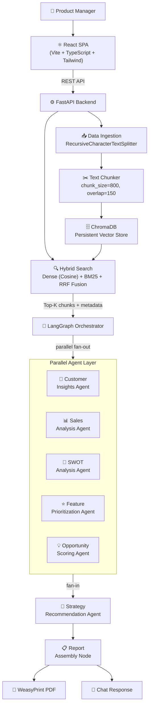

# AI-Powered Product Strategy Assistant — Architecture & Design

## 1. System Overview

The Product Strategy Assistant is a full-stack AI application that ingests structured business data (sales CSV), processes it through six parallel LangGraph agents, and delivers interactive strategic insights via a React SPA. Users can chat with the system, explore a live analytics dashboard, and download professional PDF reports.

**Key capabilities:**
- Ingest CSV, PDF, TXT, and Markdown data into a persistent ChromaDB vector store
- Hybrid dense + BM25 search for contextually relevant retrieval
- Six specialized LangGraph agents run in parallel: Customer Insights, Sales Analysis, SWOT, Feature Prioritization, Opportunity Scoring, and Strategy Synthesis
- OpenAI (gpt-4o-mini) as primary LLM with automatic three-tier failover: gpt-4o-mini → gpt-3.5-turbo → Groq llama-3.3-70b-versatile
- Interactive React SPA with Recharts dashboards, chat interface, and a downloadable PDF report generated by WeasyPrint

---

## 2. High-Level Architecture Diagram



---

## 3. Data Ingestion & Chunking Pipeline

### CSV Processing (`backend/ingestion/csv_parser.py`)
Each CSV row is converted to a rich natural-language document that combines all fields:
```
"On 2026-01-18, Laptop Air (ID: P010) in the Electronics category sold 300 units in the East
 region generating $240000.00 revenue with $118971.63 profit. Marketing spend was $40987.88.
 Customer rating: 4.9/5. Returns: 9. New customers acquired: 71.
 Customer review: "Great value for money""
```

In addition, four types of aggregated summary documents are generated automatically:
- **Product summaries** — total revenue, profit, avg rating, return rate, marketing ROI per product
- **Category summaries** — aggregated across all products per category
- **Region summaries** — aggregated per region
- **Monthly summaries** — month-over-month trends with top product by revenue

### Text Splitting (`backend/ingestion/text_splitter.py`)
Uses `RecursiveCharacterTextSplitter` from LangChain:
- `chunk_size=800`, `chunk_overlap=150`
- Separators: `["\n\n", "\n", ". ", ", ", " ", ""]`
- Short row-level documents usually fit in a single chunk; aggregate summaries may split into 2-3 chunks

### Metadata Schema
Every ChromaDB chunk carries structured metadata:
| Field | Type | Description |
|---|---|---|
| `source_type` | str | `sales_row`, `product_summary`, `category_summary`, `region_summary`, `monthly_summary`, `uploaded_doc` |
| `product_id` | str/None | e.g. `P010` |
| `product_name` | str/None | e.g. `Laptop Air` |
| `category` | str/None | Electronics, Wearables, Accessories, Audio, Smart Home |
| `region` | str/None | North, South, East, West, Central |
| `date` | str/None | `YYYY-MM-DD` format |
| `month` | str/None | `YYYY-MM` format |
| `revenue_usd` | float/None | Row or aggregate revenue |
| `profit_usd` | float/None | Row or aggregate profit |
| `customer_rating` | float/None | 1.0–5.0 |
| `chunk_index` | int | Position within parent document |
| `doc_id` | str | SHA-256 hash of parent document content |

### Deduplication
ChromaDB IDs are deterministic SHA-256 hashes of the chunk content, so re-ingesting the same file is idempotent.

---

## 4. Hybrid Search Architecture (`backend/core/vector_store.py`)

### Dense Search
- **Embeddings**: `SentenceTransformerEmbeddingFunction` with `all-MiniLM-L6-v2` (384-dim vectors)
- **Index**: ChromaDB HNSW with cosine similarity
- Supports metadata `$where` filters for efficient pre-filtering

### Sparse Search
- **BM25Okapi** from `rank-bm25` library, built over all ingested documents
- Tokenizes by whitespace for keyword matching

### Reciprocal Rank Fusion (RRF)
```
fused_score = alpha × RRF(dense_rank) + (1 - alpha) × RRF(sparse_rank)
RRF(rank) = 1 / (60 + rank + 1)
```
- `alpha = 0.6` (60% dense, 40% BM25) — tunable
- Results are re-ranked by fused score; top `TOP_K_RESULTS` (default 8) returned

### Metadata Filtering
The `build_filter()` helper builds ChromaDB `$where` dicts:
```python
{"$and": [{"category": {"$in": ["Electronics"]}}, {"customer_rating": {"$gte": 4.0}}]}
```
Supported filter dimensions: category, region, source_type, date range, min_rating.

---

## 5. Multi-Agent LangGraph Design

### Agent Responsibility Matrix

| Agent | Input | Output Fields | LLM |
|---|---|---|---|
| Customer Insights | reviews, ratings from context | sentiment, NPS, complaints, at-risk products | gpt-4o-mini → fallback |
| Sales Analysis | revenue, profit, region data | top products, margins, anomalies, growth trend | gpt-4o-mini → fallback |
| SWOT Analysis | all context + prior agent outputs | strengths, weaknesses, opportunities, threats | gpt-4o-mini → fallback |
| Feature Prioritization | customer reviews, feedback | RICE-scored feature backlog, quick wins | gpt-4o-mini → fallback |
| Opportunity Scoring | market data, regional gaps | scored opportunities (0-100), whitespace areas | gpt-4o-mini → fallback |
| Strategy Recommendation | all 5 agent outputs | executive summary, 90d/6m/12m actions, roadmap | gpt-4o-mini → fallback |

### Execution Flow
```
retrieve_context
        │
        ├──→ customer_insights ──────────┐
        ├──→ sales_analysis ─────────────┤
        ├──→ swot_analysis ──────────────┼──→ strategy_recommendation → assemble_report → END
        ├──→ feature_prioritization ─────┤
        └──→ opportunity_scoring ────────┘
```
The five analysis agents run **in parallel** (LangGraph async fan-out). The strategy agent receives all their outputs and synthesizes the final report.

### AgentState
```python
class AgentState(TypedDict):
    user_query: str
    uploaded_data_summary: str
    retrieved_context: list                        # hybrid search results
    customer_insights: Annotated[list, operator.add]
    sales_analysis: Annotated[list, operator.add]
    competitor_swot: Annotated[list, operator.add]
    feature_priorities: Annotated[list, operator.add]
    opportunity_scores: Annotated[list, operator.add]
    strategic_recommendations: Annotated[list, operator.add]
    executive_summary: str
    report_sections: dict
    chat_response: str
    agent_errors: Annotated[list, operator.add]
    processing_status: dict
```

### Error Handling
Every agent node wraps the LLM call in `try/except`. A JSON parse failure returns a partial result with `_error` key, allowing the pipeline to continue with degraded (but non-crashing) output.

### LLM Provider Chain (`backend/core/llm_router.py`)
```
Step 1: OpenAI gpt-4o-mini  (json_mode=True, timeout=45s)
         ├── Success → return
         └── RateLimitError / 5xx / ConnectionError → Step 2

Step 2: OpenAI gpt-3.5-turbo  (json_mode=True, timeout=30s)
         ├── Success → return, increment fallback_count
         └── Any error → Step 3

Step 3: Groq llama-3.3-70b-versatile  (json_mode=True, timeout=30s)
         ├── Success → return, increment fallback_count
         └── Any error → raise LLMUnavailableError
```
Auth errors and bad-request errors are **not** retried (same prompt would fail on any provider).

---

## 6. API Specification

| Method | Path | Description |
|---|---|---|
| `POST` | `/api/ingest` | Upload files (CSV, PDF, TXT, MD); auto-ingests on startup |
| `POST` | `/api/chat` | Send a message; runs full LangGraph pipeline |
| `POST` | `/api/analyze` | Full analysis; returns complete AgentState |
| `GET` | `/api/report?format=pdf\|json` | Download last analysis as PDF or JSON |
| `GET` | `/api/dashboard` | Aggregated KPIs and chart data from CSV |
| `GET` | `/api/health` | Service health, LLM provider, collection stats |

**Request: `POST /api/chat`**
```json
{
  "message": "Which products have the lowest satisfaction?",
  "filters": {
    "categories": ["Electronics"],
    "regions": ["West"],
    "min_rating": 3.5
  }
}
```

**Response: `POST /api/chat`**
```json
{
  "response": "## Strategic Analysis Results\n\n...",
  "agent_outputs": {
    "customer_insights": {...},
    "sales_analysis": {...},
    "swot": {...},
    "feature_priorities": {...},
    "opportunities": {...},
    "strategy": {...}
  },
  "sources": [{"document": "...", "metadata": {...}}]
}
```

---

## 7. Frontend Architecture

```
App.tsx (BrowserRouter)
├── Navbar.tsx           — logo, nav links, dark mode toggle
├── Dashboard.tsx        — KPI cards, AreaChart, BarChart, PieChart, RadarChart, top products table
├── Chat.tsx             — sidebar filters, chat bubbles, agent output accordions
└── Report.tsx           — generate/download buttons, preview of all report sections

src/store/useAnalysisStore.ts   — Zustand: dashboardData, chatMessages, analysisResult, filters
src/api/client.ts               — Axios wrappers, typed interfaces for all endpoints
```

**Dashboard data flow:**
1. `useEffect` on mount calls `fetchDashboard()` (Zustand action)
2. Action calls `GET /api/dashboard` via Axios
3. Response sets `dashboardData` in Zustand
4. Recharts components read from `dashboardData`
5. Auto-refresh every 60 seconds

**Chat data flow:**
1. User submits message → `sendMessage()` action
2. User message appended to `chatMessages` immediately (optimistic)
3. `POST /api/chat` called with message + active filters
4. Response sets assistant message with `agentOutputs` attached
5. `AgentCard` accordions render agent-specific sub-components (SWOTGrid, RICETable, OpportunityCard)

---

## 8. PDF Report Generation

**Pipeline:** `Jinja2 HTML template` → `WeasyPrint` → `PDF bytes`

`ReportGenerator.generate_pdf()` passes the full `AgentState.report_sections` dict to the Jinja2 template (`backend/templates/report.html`), which renders:
- Cover page with date and AI badge
- Table of contents
- 8 sections: Executive Summary, Sales Performance, Customer Insights, SWOT (2×2 grid), Feature RICE table, Opportunity cards, Strategic Action Plan (3 horizons), Product Roadmap

All CSS is inline for WeasyPrint compatibility. Color scheme: `#6366F1` headers, `#1E293B` body.

---

## 9. Sample Data Overview

**File:** `sample_data/Sample_Sales_Data.csv`
- **Date range:** 2026-01-01 to 2026-04-30 (4 months, 120 rows)
- **10 products:** SmartWatch X, FitBand Pro, NoiseBuds Air, PowerBank Max, Gaming Mouse Pro, Wireless Keyboard, Smart Speaker, Security Camera, Tablet Lite, Laptop Air
- **5 categories:** Electronics, Wearables, Accessories, Audio, Smart Home
- **5 regions:** North, South, East, West, Central

**Fields per row:**
| Field | Type | Notes |
|---|---|---|
| Date | date | YYYY-MM-DD |
| Product_ID | str | P001–P010 |
| Product_Name | str | Human-readable name |
| Category | str | One of 5 categories |
| Region | str | One of 5 regions |
| Units_Sold | int | Units per transaction |
| Revenue_USD | float | Gross revenue |
| Cost_USD | float | COGS |
| Profit_USD | float | Revenue − Cost |
| Marketing_Spend_USD | float | Marketing investment |
| Customer_Rating | float | 1.0–5.0 |
| Returns | int | Units returned |
| New_Customers | int | New customers acquired |
| Review | str | Free-text customer review |

---

## 10. Key Design Decisions

### RecursiveCharacterTextSplitter vs Other Splitters
`RecursiveCharacterTextSplitter` attempts to split on paragraph → sentence → word boundaries before falling back to character-level splitting, preserving semantic coherence better than fixed-size character splitting. This is especially important for review texts and summaries where meaning spans multiple sentences.

### Hybrid Search vs Pure Dense Search
Pure dense search excels at semantic similarity but misses exact-match keywords (product IDs, specific model names, metric values). BM25 catches these exact matches. RRF fusion combines both signals without requiring score normalization, giving robust results across both semantic and keyword queries.

### LangGraph Parallel Agents vs Sequential Chain
Sequential chains bottle-neck on the slowest agent. With 5 parallel agents each making an LLM call (~2-5s), parallel execution reduces total wall-clock time from ~25s to ~5-7s. LangGraph's `Annotated[list, operator.add]` merge semantics handle the fan-in cleanly without explicit synchronization code.

### ChromaDB Metadata Design
Storing structured fields (category, region, date, rating) as metadata (not just inside the document text) enables efficient pre-filtering before the vector search, avoiding irrelevant chunks polluting the top-K results. For example, "Electronics in West region" queries filter at the index level.

### RICE Framework for Feature Prioritization
RICE (Reach × Impact × Confidence / Effort) is a well-understood product management framework. By having the LLM output each component separately, product managers can audit and override individual scores rather than treating the final number as a black box.

---

## 11. Local Development Setup

### Backend
```bash
cd product-strategy-assistant
pip install -r requirements.txt
cp .env.example .env
# Edit .env and add your OPENAI_API_KEY (and optionally GROQ_API_KEY)
python -m backend.main
# → Starts on http://localhost:8000
# → Auto-ingests Sample_Sales_Data.csv on first run
```

### Frontend
```bash
cd frontend
npm install
npm run dev
# → Starts on http://localhost:5173
# → /api/* proxied to http://localhost:8000
```

### Environment Variables (`.env`)
| Variable | Required | Default | Description |
|---|---|---|---|
| `OPENAI_API_KEY` | Yes | — | Primary LLM |
| `OPENAI_MODEL` | No | `gpt-4o-mini` | Primary model |
| `OPENAI_FALLBACK_MODEL` | No | `gpt-3.5-turbo` | OpenAI fallback |
| `GROQ_API_KEY` | No | — | Enables Groq fallback |
| `GROQ_MODEL` | No | `llama-3.3-70b-versatile` | Groq model |
| `CHROMA_PERSIST_DIR` | No | `./chroma_db` | ChromaDB storage path |
| `CHUNK_SIZE` | No | `800` | Text splitter chunk size |
| `TOP_K_RESULTS` | No | `8` | Retrieval top-K |
| `CORS_ORIGINS` | No | `http://localhost:5173` | Allowed CORS origins |

---

## 12. Deployment Guide

### Docker Compose
```bash
cp .env.example .env
# Add API keys to .env
docker-compose up --build
# Backend: http://localhost:8000
# Frontend: http://localhost:5173
```

### `docker-compose.yml` services:
- **backend**: FastAPI on port 8000, mounts `./chroma_db` volume for persistence
- **frontend**: Vite dev server on port 5173 with backend proxy

### Production Build
```bash
cd frontend && npm run build   # outputs to frontend/dist/
# FastAPI serves frontend/dist as static files via StaticFiles mount
# Deploy backend only — no separate frontend server needed
```
